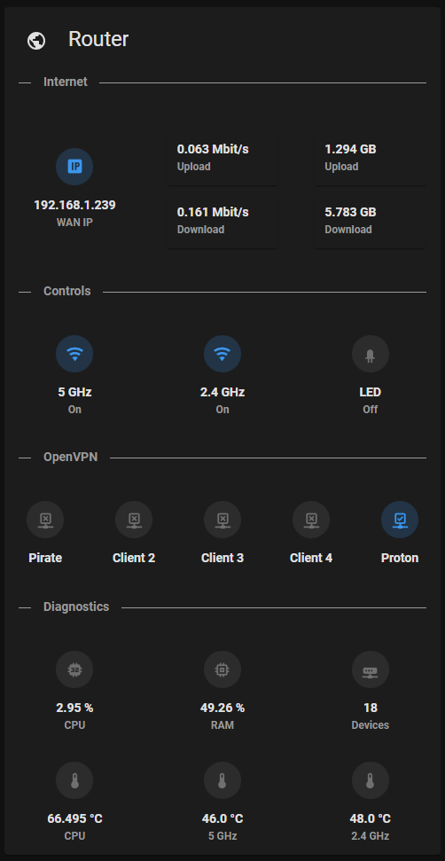
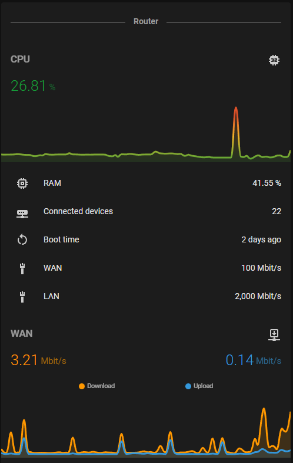
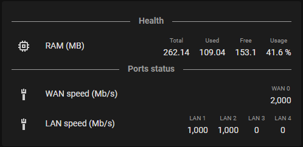

## Dashboards ideas for AsusRouter integration

### Simple dashboard



<details>
<summary>List of custom cards</summary>

- [stack-in-card](https://github.com/custom-cards/stack-in-card)
- [text-divider-row](https://github.com/iantrich/text-divider-row)
- [mushroom-entity-card](https://github.com/piitaya/lovelace-mushroom) & mushroom-light-card
</details>

<details>
<summary>YAML code</summary>

*Replace `rt_ax88u` with your device*

```yaml
type: custom:stack-in-card
cards:
  - type: entities
    title: Router
    icon: mdi:earth
    entities:
      - type: custom:text-divider-row
        text: Internet
        align: left
  - type: grid
    square: false
    columns: 3
    cards:
      - type: custom:mushroom-entity-card
        entity: sensor.rt_ax88u_wan_ip
        name: WAN IP
        primary_info: state
        secondary_info: name
        layout: vertical
        fill_container: true
      - type: entities
        entities:
          - type: custom:mushroom-entity-card
            entity: sensor.rt_ax88u_wan_upload_speed
            name: Upload
            primary_info: state
            secondary_info: name
            layout: horizontal
            icon: ''
            fill_container: false
            icon_type: none
          - type: custom:mushroom-entity-card
            entity: sensor.rt_ax88u_wan_download_speed
            name: Download
            primary_info: state
            secondary_info: name
            layout: horizontal
            icon_type: none
      - type: entities
        entities:
          - type: custom:mushroom-entity-card
            entity: sensor.rt_ax88u_wan_upload
            name: Upload
            primary_info: state
            secondary_info: name
            layout: horizontal
            icon: ''
            fill_container: false
            icon_type: none
          - type: custom:mushroom-entity-card
            entity: sensor.rt_ax88u_wan_download
            name: Download
            primary_info: state
            secondary_info: name
            layout: horizontal
            icon_type: none
  - type: entities
    entities:
      - type: custom:text-divider-row
        text: Controls
        align: left
  - type: grid
    square: false
    columns: 3
    cards:
      - type: custom:mushroom-entity-card
        entity: switch.rt_ax88u_wireless_5_ghz
        name: 5 GHz
        primary_info: name
        secondary_info: state
        layout: vertical
        tap_action:
          action: more-info
        hold_action:
          action: toggle
        double_tap_action:
          action: none
      - type: custom:mushroom-entity-card
        entity: switch.rt_ax88u_wireless_2_4_ghz
        name: 2.4 GHz
        primary_info: name
        secondary_info: state
        layout: vertical
        tap_action:
          action: more-info
        hold_action:
          action: toggle
        double_tap_action:
          action: none
      - type: custom:mushroom-light-card
        entity: light.rt_ax88u_led
        name: LED
        primary_info: name
        secondary_info: state
        layout: vertical
        tap_action:
          action: more-info
        hold_action:
          action: toggle
        double_tap_action:
          action: none
  - type: entities
    entities:
      - type: custom:text-divider-row
        text: OpenVPN
        align: left
  - square: false
    columns: 5
    type: grid
    cards:
      - type: custom:mushroom-entity-card
        entity: switch.rt_ax88u_openvpn_client_1
        name: Client 1
        primary_info: name
        secondary_info: none
        layout: vertical
        tap_action:
          action: more-info
        hold_action:
          action: toggle
        double_tap_action:
          action: none
      - type: custom:mushroom-entity-card
        entity: switch.rt_ax88u_openvpn_client_2
        name: Client 2
        primary_info: name
        secondary_info: none
        layout: vertical
        tap_action:
          action: more-info
        hold_action:
          action: toggle
        double_tap_action:
          action: none
      - type: custom:mushroom-entity-card
        entity: switch.rt_ax88u_openvpn_client_3
        name: Client 3
        primary_info: name
        secondary_info: none
        layout: vertical
        tap_action:
          action: more-info
        hold_action:
          action: toggle
        double_tap_action:
          action: none
      - type: custom:mushroom-entity-card
        entity: switch.rt_ax88u_openvpn_client_4
        name: Client 4
        primary_info: name
        secondary_info: none
        layout: vertical
        tap_action:
          action: more-info
        hold_action:
          action: toggle
        double_tap_action:
          action: none
      - type: custom:mushroom-entity-card
        entity: switch.rt_ax88u_openvpn_client_5
        name: Client 5
        primary_info: name
        secondary_info: none
        layout: vertical
        tap_action:
          action: more-info
        hold_action:
          action: toggle
        double_tap_action:
          action: none
  - type: entities
    entities:
      - type: custom:text-divider-row
        text: Diagnostics
        align: left
  - type: grid
    square: false
    columns: 3
    cards:
      - type: custom:mushroom-entity-card
        entity: sensor.rt_ax88u_cpu
        name: CPU
        primary_info: state
        secondary_info: name
        layout: vertical
        icon_color: disabled
      - type: custom:mushroom-entity-card
        entity: sensor.rt_ax88u_ram
        name: RAM
        primary_info: state
        secondary_info: name
        layout: vertical
        icon_color: disabled
      - type: custom:mushroom-entity-card
        entity: sensor.rt_ax88u_connected_devices
        name: Devices
        primary_info: state
        secondary_info: name
        layout: vertical
        icon_color: disabled
      - type: custom:mushroom-entity-card
        entity: sensor.rt_ax88u_temperature_cpu
        name: CPU
        primary_info: state
        secondary_info: name
        layout: vertical
        icon_color: disabled
      - type: custom:mushroom-entity-card
        entity: sensor.rt_ax88u_temperature_5_ghz
        name: 5 GHz
        primary_info: state
        secondary_info: name
        layout: vertical
        icon_color: disabled
      - type: custom:mushroom-entity-card
        entity: sensor.rt_ax88u_temperature_2_4_ghz
        name: 2.4 GHz
        primary_info: state
        secondary_info: name
        layout: vertical
        icon_color: disabled

```
</details>

### Status dashboard



<details>
<summary>List of custom cards</summary>

- [stack-in-card](https://github.com/custom-cards/stack-in-card)
- [text-divider-row](https://github.com/iantrich/text-divider-row)
- [mini-graph-card](https://github.com/kalkih/mini-graph-card)
</details>

<details>
<summary>YAML code</summary>

*Replace `rt_ac66u` with your device*

```yaml
type: custom:stack-in-card
cards:
  - type: entities
    entities:
      - text: Router
        type: custom:text-divider-row
  - type: custom:mini-graph-card
    name: CPU
    color_thresholds:
      - color: '#159F3B'
        value: 0
      - color: '#F2B528'
        value: 50
      - color: '#DD5129'
        value: 80
    decimals: 2
    entities:
      - entity: sensor.rt_ac66u_cpu
        name: CPU
        show_state: true
        state_adaptive_color: true
    font_size: 75
    hour24: true
    hours_to_show: 1
    line_width: 3
    points_per_hour: 120
    update_interval: 10
  - type: entities
    entities:
      - entity: sensor.rt_ac66u_ram
        name: RAM
      - entity: sensor.rt_ac66u_connected_devices
        name: Connected devices
      - entity: sensor.rt_ac66u_boot_time
        name: Boot time
      - entity: sensor.rt_ac66u_wan_speed
        name: WAN
      - entity: sensor.rt_ac66u_lan_speed
        name: LAN
  - type: custom:mini-graph-card
    name: WAN
    decimals: 2
    entities:
      - entity: sensor.rt_ac66u_wan_download_speed
        name: Download
        show_state: true
        state_adaptive_color: true
      - entity: sensor.rt_ac66u_wan_upload_speed
        name: Upload
        show_state: true
        state_adaptive_color: true
    font_size: 75
    hour24: true
    hours_to_show: 3
    line_width: 3
    points_per_hour: 30
    update_interval: 300
```
</details>


### Idea for those who like to monitor everything



<details>
<summary>List of custom cards</summary>

- [stack-in-card](https://github.com/custom-cards/stack-in-card)
- [multiple-entity-row](https://github.com/benct/lovelace-multiple-entity-row)
</details>

<details>
<summary>YAML code</summary>

*Replace `rt_ac66u` with your device*

```yaml
type: custom:stack-in-card
cards:
  - type: entities
    entities:
      - type: custom:text-divider-row
        text: Health
      - type: custom:multiple-entity-row
        entity: sensor.rt_ac66u_ram
        name: RAM (MB)
        show_state: true
        state_header: Usage
        entities:
          - entity: sensor.rt_ac66u_ram
            attribute: Total
            name: Total
            format: kilo
          - entity: sensor.rt_ac66u_ram
            attribute: Used
            name: Used
            format: kilo
          - entity: sensor.rt_ac66u_ram
            attribute: Free
            name: Free
            format: kilo
      - type: custom:text-divider-row
        text: Ports status
      - type: custom:multiple-entity-row
        entity: sensor.rt_ac66u_lan_speed
        name: WAN speed (Mb/s)
        show_state: true
        state_header: WAN 0
        unit: false
      - type: custom:multiple-entity-row
        entity: sensor.rt_ac66u_lan_speed
        name: LAN speed (Mb/s)
        show_state: false
        entities:
          - entity: sensor.rt_ac66u_lan_speed
            attribute: LAN 1
            name: LAN 1
          - entity: sensor.rt_ac66u_lan_speed
            attribute: LAN 2
            name: LAN 2
          - entity: sensor.rt_ac66u_lan_speed
            attribute: LAN 3
            name: LAN 3
          - entity: sensor.rt_ac66u_lan_speed
            attribute: LAN 4
            name: LAN 4

```
</details>


