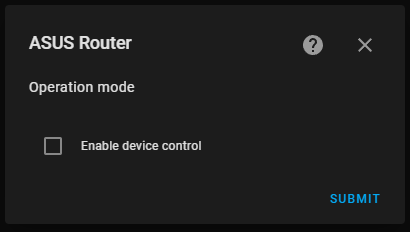
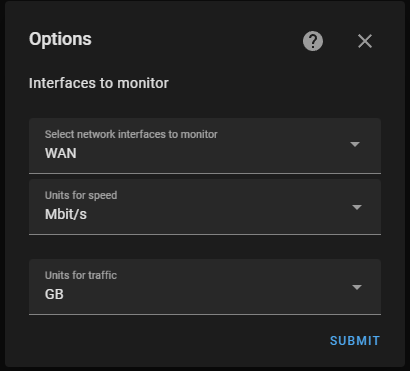

# Integration setup

***The information is correct for [the versions](https://github.com/Vaskivskyi/ha-asusrouter/releases) 0.3.0+***

The setup process is split into `configuration flow` steps for simplicity. This also allows for better error reporting and easier troubleshooting.

## #1. Device discovery

**Values:**
- `hostname` (or IP address of the device).

The first step is device discovery. The integration will check if the device `hostname` can be resolved.
s
**Possible errors:**
- `Hostname cannot be resolved`. Reported at `ERROR` level in the log. This problem can be fixed by providing the IP address instead.

## #2. Credentials (simplified setup)

**Values:**
- `username` - the same as for the device web panel access. The default value is `admin`.
- `password`.
- `use SSL` - whether SSL should be used for the connection. The recommended value is `True`. Please note, that the non-SSL connection is only possible on LAN (local network). If you try to connect to the device via WAN, only SSL is allowed or the `Connection refused` error will be triggered. WAN access should also be manually turned on in the device settings.

This step allows performing a simplified setup. By providing these values, the integration will try to connect to the device using all other default values, including `port` as `80` or `8443` depending on the `use SSL value.

**Possible errors:**
- `Connection refused`. Reported at `DEBUG` level in the log. This error will redirect the user to step **#2b**.
- `Wrong credentials`. Reported at `ERROR` level. Either `username` or `password` is wrong. But the connection is possible, so the user will stay on the same step until the correct credentials are provided.
- `Login is blocked`. Reported at `ERROR` level. Too many attempts of using the wrong credentials were made. The user should wait until the timeout is over to try again (or the device should be rebooted). The timeout value in seconds is provided in the log message.

## #2b. Complete device setup

*This step can be reached only if step **#2** failed with a `Connection refused` error. In this case, the entered values are transferred to this step automatically.*

**Values:**
- `username`.
- `password`.
- `port` - the port for connection to the device. The same as used for the device web panel. The default value `0` will use either `80` or `8443` depending on the `use SSL` value.
- `use SSL`.
- `verify SSL` - whether SSL certificate should be checked. The default value is `True`.
- `certificate path` - path to the user-defined SSL certificate for the check.

**Possible errors:**
- `Connection refused`. Reported at `ERROR` level in the log.
- `Wrong credentials`. Reported at `ERROR` level.
- `Login is blocked`. Reported at `ERROR` level.
- `Error` / `Unknown`. Reported at `ERROR` level. Please, refer to the log for more information.

## #3. Operation mode

**Values:**
- `enable monitoring`. Please, keep it `True`, since the `False` functionality is not completely implemented yet and will result in integration failures.
- `enable control` - whether switches, services and more control functions for your device should be enabled in the integration. The default value is `False`.

## #4. Network interfaces to monitor (optional)

*This step can be reached only if `enable monitoring` in step **#3** was set to `True`.*

**Values:**
- `Interfaces` - which network interfaces should be monitored

## #5. Rename device

**Values:**
- `name` - custom device name if user wishes. If left empty, the device model will be used

