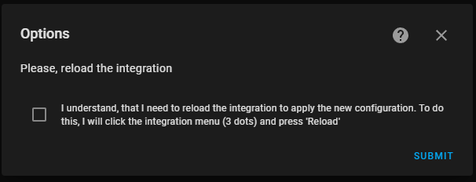

# Integration setup

***The information is correct for [the versions](https://github.com/Vaskivskyi/ha-asusrouter/releases) 0.3.0+***

The setup process is split into `configuration flow` steps for simplicity. This also allows for better error reporting and easier troubleshooting.

## #1. Device discovery

**Values:**
- `hostname` (or IP address of the device).

The first step is device discovery. The integration will check if the device `hostname` can be resolved.

**Possible errors:**
- `Hostname cannot be resolved`. Reported at `ERROR` level in the log. This problem can be fixed by providing the IP address instead.

## #2. Credentials (simplified setup)

**Values:**
- `username` - the same as for the device web panel access. The default value is `admin`.
- `password`.
- `use SSL` - whether SSL should be used for the connection. The recommended value is `True`. Please note, that the non-SSL connection is only possible on LAN (local network). If you try to connect to the device via WAN, only SSL is allowed or the `Connection refused` error will be triggered. WAN access should also be manually turned on in the device settings.

This step allows performing a simplified setup. By providing these values, the integration will try to connect to the device using all other default values, including `port` as `80` or `8443` depending on the `use SSL value.

**Possible errors:**
- `Connection refused`. Reported at `DEBUG` level in the log. This error will redirect the user to step **#2b**.
- `Wrong credentials`. Reported at `ERROR` level. Either `username` or `password` is wrong. But the connection is possible, so the user will stay on the same step until the correct credentials are provided.
- `Login is blocked`. Reported at `ERROR` level. Too many attempts of using the wrong credentials were made. The user should wait until the timeout is over to try again (or the device should be rebooted). The timeout value in seconds is provided in the log message.

## #2b. Complete device setup

*This step can be reached only if step **#2** failed with a `Connection refused` error. In this case, the entered values are transferred to this step automatically.*

**Values:**
- `username`.
- `password`.
- `port` - the port for connection to the device. The same as used for the device web panel. The default value `0` will use either `80` or `8443` depending on the `use SSL` value.
- `use SSL`.
- `verify SSL` - whether SSL certificate should be checked. The default value is `True`.
- `certificate path` - path to the user-defined SSL certificate for the check.

**Possible errors:**
- `Connection refused`. Reported at `ERROR` level in the log.
- `Wrong credentials`. Reported at `ERROR` level.
- `Login is blocked`. Reported at `ERROR` level.
- `Error` / `Unknown`. Reported at `ERROR` level. Please, refer to the log for more information.

## #3. Operation mode

**Values:**
<!--- `enable monitoring`. Please, keep it `True`, since the `False` functionality is not completely implemented yet and will result in integration failures.-->
- `enable control` - whether switches, services and more control functions for your device should be enabled in the integration. The default value is `False`.

## #4. Time constants

**Values:**
- `cache time` - the amount of time for the [asusrouter](https://github.com/Vaskivskyi/asusrouter) library behind the integration to store obtained data (e.g. some data is obtained in bulk and then split for different sensors in Home Assistant). Thanks to caching, it is possible to decrease the amount of traffic to the device and minimize its response time. The default (and recommended value) is `5` seconds. This time constant should be always lower than the `scan interval` value.
- `scan interval` - how regularly sensors should be pulled. The default value is `30` seconds. Even though the user may want to decrease it as low as possible, please, note, that older Asus devices (especially single-core ones) cannot handle high traffic well and may become unresponsive. We do not recommend setting this value below `10` seconds.
- `consider home` - how fast the integration should consider connected devices `not home` after they were last seen. E.g., the default value `45` seconds means that the connected device will not be set as `not home` earlier than 45 seconds. If the user wants to receive a `not home` value as soon as the device goes offline, this value should be lower than the `scan interval`.

For a better understanding of how `consider home` works, here are two examples:
1. User has `consider home` set to `45` seconds and `scan interval` set to `30`. The last scan happened at 01:00:00 and the device was `online`. The next scan at 01:00:30 has shown the device being `offline`. But we allow 45 seconds, so the integration will leave the state as it was this time. On the next scan at 01:01:00 device is still offline and it is already `60` seconds after the device was last seen. So now it will get state `not home`.
2. `consider home` set to `7` and `scan interval` set to `10`. In this case, as soon as the next check is performed, the device will receive a `not home` state.

## #5. Network interfaces to monitor

**Values:**
- `interfaces` - which network interfaces should be monitored
- `units speed` - which units to use for the network interface speed. Default: `Mbit/s`
- `units traffic` - which units to use for the network traffic. Default: `GB`

## #6. Rename device

**Values:**
- `name` - custom device name if user wishes. If left empty, the device model will be used

# Integration options

Almost all of the configuration settings can be changed after the initial setup. Reconfiguring is done via the `Configure` button on the integrations page.

## Select

The options flow allows the user to select what exactly settings should be changed. User can repeat steps **#2b**, **#3**, **#4**, **#5** of the initial setup. Only the selected steps will be shown.

## Confirm

To apply the new configuration, the user should reload the integration (or the whole Home Assistant, but that is a bit too much). The step is only set to make sure of that.

